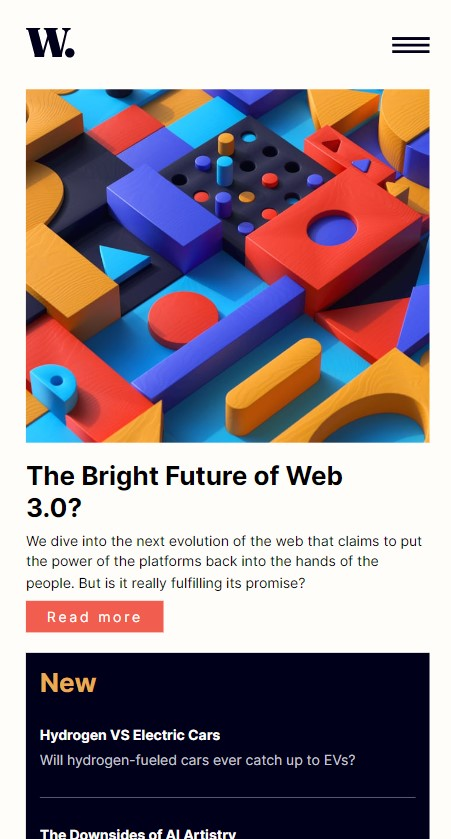
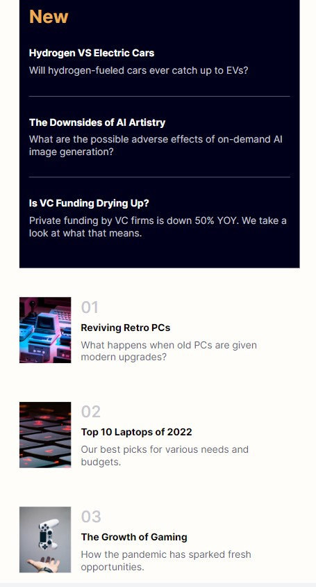
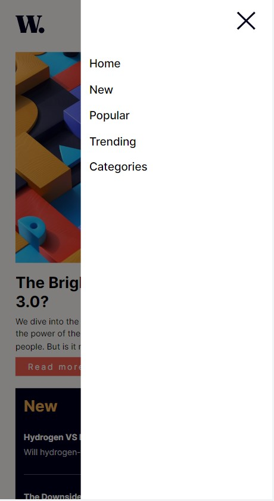
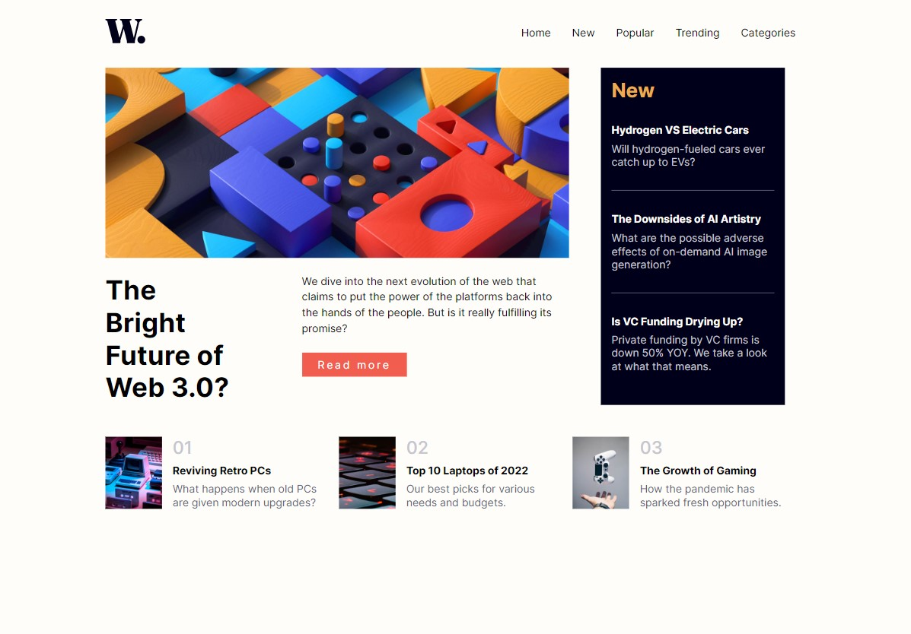

# Frontend Mentor - News homepage solution

This is a solution to the [News homepage challenge on Frontend Mentor](https://www.frontendmentor.io/challenges/news-homepage-H6SWTa1MFl). Frontend Mentor challenges help you improve your coding skills by building realistic projects. 

## Table of contents

- [Overview](#overview)
  - [The challenge](#the-challenge)
  - [Screenshot](#screenshot)
  - [Links](#links)
- [My process](#my-process)
  - [Built with](#built-with)
  - [What I learned](#what-i-learned)
  - [Continued development](#continued-development)
  - [Useful resources](#useful-resources)
- [Author](#author)

## Overview

### The challenge

Users should be able to:

- View the optimal layout for the interface depending on their device's screen size
- See hover and focus states for all interactive elements on the page

### Screenshot

<h2>Mobile view</h2>

<----->

<----->

<h2>Desktop view</h2>

### Links
- Live Site URL: [Add live site URL here](https://omarismail7980.github.io/news-homepage/)

## My process
- Used HTML,CSS & Javascript for this project
- I started sketching the layout on a piece of paper than afterwards I created the desktop layout than then the mobile layout.

### Built with
- HTML, CSS and Javascript
- for CSS I used a combination of Grid and Flexbox

### What I learned

I learned how to use Grid. Since I prefer using flexbox most of the time I havenlt used Grid that much. Inorder to have the New section and main headline section next to each while maintaining there sizes it Grid was the best choice for the job.

### Continued development

I need to focus on making more responsive and try using mobile first approach to develop my solution since many people use their phones to access sites.

I also need to practice using grid more often.

### Useful resources

- W3-school and Youtube helped me learn grid and they're great resources for learning new topics in a way that will save time

## Author

- Website - [Omar Ismail](https://omarismail7980.github.io/Portfolio/)
- Frontend Mentor - [omar ismail](https://www.frontendmentor.io/profile/OmarIsmail7980)

